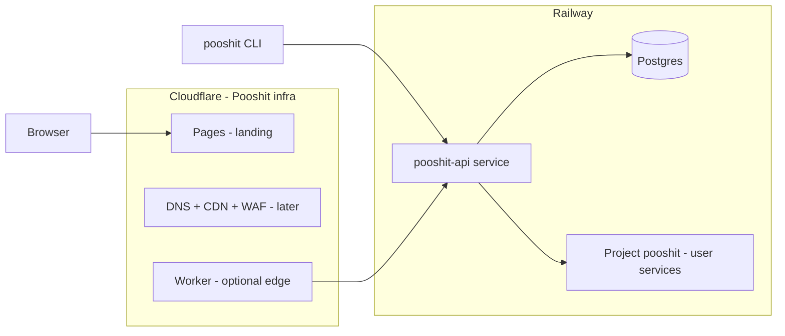
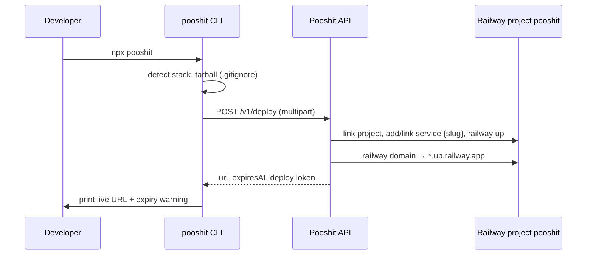

# Pooshit — Handover

One-command hosting: `npx pooshit` packs your project, uploads it to the Pooshit API, and deploys it to **our** Railway account. Users never log into Railway.

## Product model

| Tier | Limits |
|------|--------|
| **Free** | 50 MB upload, live 24h, random slug, no signup |
| **Pro (planned)** | $9.99/mo — 500 MB, permanent, custom subdomain/domain |

Railway is our VPS for **user apps**. Each user deploy = **one service** inside a shared Railway project (`pooshit`), not a new Railway project per deploy.

**User deploys stay on Railway.** Cloudflare is for **Pooshit's own** website, CDN, and optional edge layer — not for running user app code (v1).

**No custom domain yet** — API and user deploys use Railway URLs (`*.up.railway.app`); landing can use Cloudflare Pages preview URL until a domain is registered.

---

## Production architecture (Cloudflare + Railway)



| Component | Platform | URL (v1, no domain) | Notes |
|-----------|----------|---------------------|-------|
| **Landing site** | **Cloudflare Pages** | `*.pages.dev` | Build `apps/web` from GitHub |
| **Deploy API** | **Railway** | `*.up.railway.app` | Tarball + deploy orchestration |
| **Database** | **Railway Postgres** | internal | Replace SQLite before prod |
| **User deploys** | **Railway** | `*.up.railway.app` | Services inside shared `pooshit` project |

### Two Railway projects/services (keep separate)

```
Railway workspace
├── Project: pooshit-api          ← OUR backend (Hono API only)
│   └── Service: api
│   └── Postgres plugin
│
└── Project: pooshit              ← USER deploys (RAILWAY_PROJECT)
    ├── Service: abc123           ← one per user deploy
    ├── Service: xyz789
    └── ...
```

Do **not** run the Pooshit API in the same Railway project as user deploys — cleaner billing, ops, and blast radius.

### Rollout order (no domain required)

1. Railway Postgres + deploy `pooshit-api` → note public API URL
2. Create Railway project `pooshit` for user deploys
3. Publish `pooshit` to npm with `POOSHIT_API_URL` pointing at Railway API
4. Cloudflare Pages for landing (set `VITE_API_URL` to same Railway API URL)
5. Later: buy domain, DNS, optional Worker for rate limiting
6. Later: wildcard subdomains for user deploys via `POOSHIT_DOMAIN`

### Future: Hetzner hybrid (staged, not active)

**v1 stays Railway-only** — all deploys (static + Node) go to the shared `pooshit` Railway project.

Code and docs for **Option A** (static sites → Hetzner CPX22 via SSH, Node → Railway) are already in the repo but **disabled by default**. Nothing routes to Hetzner unless you set `HETZNER_STATIC_ENABLED=true` plus SSH/domain env vars on the API.

| When ready | Where |
|------------|--------|
| API integration | `packages/api/src/hetzner/` |
| VPS + Caddy setup | `infra/hetzner/README.md` |
| Env reference | `packages/api/.env.production.example` |

Expected win when enabled: static deploys in ~2–5s on a ~€8/mo CPX22 instead of ~60s Railway service spin-up.

---

## Repo structure

```
hostie/                    ← local folder name (rename optional)
├── packages/cli/          # npm package "pooshit" → bin: pooshit
├── packages/api/          # Hono API — upload, Railway orchestration, TTL cleanup
├── apps/web/              # Landing page (Vite + React + Tailwind)
├── HANDOVER.md            # this file
└── TODO.md                # pre-launch checklist
```

---

## How a deploy works



**Redeploy:** same directory sends `deployToken` → updates existing service instead of creating a new one.

**Expiry:** cron every 15 min + on API startup deletes expired services via Railway GraphQL (`serviceDelete`), marks deploy `expired` in DB.

---

## Local development

### Prerequisites

- Node 18+
- [Railway CLI](https://docs.railway.com/cli) installed
- `railway login` (for local API — no token needed if `RAILWAY_USE_CLI_LOGIN=true`)
- A Railway project named **`pooshit`** (or set `RAILWAY_PROJECT` to your project name/ID)

### Run the API

```bash
cd packages/api
cp ../../.env.example .env   # then edit
npm run dev
```

Expected startup logs:

```
Railway: Logged in as ...
Railway workspace: ... (auto-detected)
Railway project: pooshit (...)
pooshit api listening on http://localhost:3099
Using railway login session
```

### Deploy a test site

```bash
mkdir /tmp/pooshit-test && echo '<h1>hello</h1>' > /tmp/pooshit-test/index.html

cd /tmp/pooshit-test
POOSHIT_API_URL=http://localhost:3099 node ~/Projects/hostie/packages/cli/dist/index.js

# or from repo root:
POOSHIT_API_URL=http://localhost:3099 npm run pooshit
```

### Landing page

```bash
npm run dev:web   # http://localhost:5173
```

---

## Environment variables (`packages/api/.env`)

| Variable | Purpose |
|----------|---------|
| `PORT` | API port (default `3099`) |
| `MOCK_DEPLOYS` | `true` = fake URLs, no Railway calls |
| `RAILWAY_USE_CLI_LOGIN` | `true` = use `railway login` session locally |
| `RAILWAY_API_TOKEN` | Account token for production |
| `RAILWAY_PROJECT` | Shared project name or UUID (default `pooshit`) |
| `RAILWAY_ENVIRONMENT` | Usually `production` |
| `RAILWAY_WORKSPACE` | Only if multiple workspaces |
| `POOSHIT_DOMAIN` | Leave unset for `*.up.railway.app`; set when you own a domain |
| `FREE_TTL_HOURS` | Default `24` |
| `FREE_MAX_BYTES` | Default `52428800` (50 MB) |
| `POOSHIT_API_URL` | CLI env — API endpoint (default `http://localhost:3099`) |

---

## API endpoints

| Method | Path | Description |
|--------|------|-------------|
| `GET` | `/health` | `{ ok, mockDeploys, useCliLogin }` |
| `GET` | `/v1/stats` | `{ totalDeploys, liveDeploys }` |
| `POST` | `/v1/deploy` | multipart: `archive`, `stack`, optional `deployToken` |
| `GET` | `/v1/deploy/:id/status` | poll deploy state |
| `GET` | `/v1/deploy/token/:token` | lookup by deploy token |

---

## Database

SQLite via Drizzle locally (`packages/api/pooshit.db`). Postgres in production. Tables: `deploys`, `users`, `api_keys` (users/keys unused until Pro auth).

Deploy record fields that matter:

- `slug` — public subdomain slug (also Railway service name)
- `deployToken` — `ps_...` for redeploys
- `expiresAt` — null for Pro (not implemented yet)
- `railwayProjectId`, `railwayServiceId` — for cleanup

---

## CLI commands

| Command | Status |
|---------|--------|
| `pooshit` / `pooshit deploy` | ✅ Works |
| `pooshit status` | ✅ Local state only |
| `pooshit open` | ✅ |
| `pooshit upgrade` | ⏳ Stub ("coming soon") |
| `pooshit login` | ⏳ Stub |
| `pooshit logs` | ⏳ Stub |

CLI stores last deploy in `~/.pooshit/deploys.json`.

Default API URL in CLI: `http://localhost:3099` (set `POOSHIT_API_URL` to Railway URL for production).

---

## What's NOT built yet

See [TODO.md](./TODO.md) for the full pre-launch list. Highlights:

- npm publish (`pooshit` — name available)
- Production API deployment on Railway
- Pro tier / Stripe / GitHub auth
- Custom domain (deferred — not blocking v1)
- Logs proxy, monitoring, tests

---

## Key files to read first

| File | Why |
|------|-----|
| `packages/api/src/services/deploy.ts` | Upload handling, rate limits, TTL cleanup |
| `packages/api/src/railway/deploy.ts` | Railway link → add service → up → domain |
| `packages/api/src/railway/graphql.ts` | Service delete, project lookup |
| `packages/cli/src/commands.ts` | Deploy UX |
| `packages/api/src/env.ts` | Auth mode / token stripping |

---

## Ownership / accounts

- **Cloudflare:** Pages (landing), DNS/CDN when domain exists
- **Railway:** `pooshit-api` backend + `pooshit` project for user deploy services
- **npm:** `pooshit` not published yet (name available ✓)
- **Domain:** TBD — not required for v1 launch

---

## Contact / context

Built as a viral hacky CLI product: zero signup, 24h free hosting, upsell to Pro. Railway is an implementation detail users never see.
